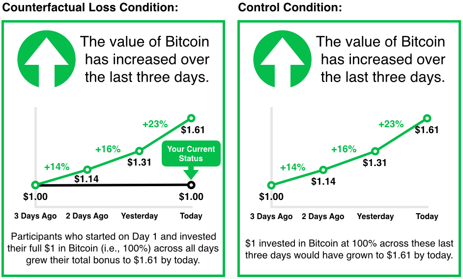

```{r setup, warning = FALSE, message = FALSE}
# Load packages
library(knitr) # Required for knitting
library(papaja) # Required for APA template
library(citr) # Required for easy insertion of citations
library(tidyverse) # Required for data cleaning
library(broman) # Required for myround() function that doesn't truncate digits
library(rIP) # Required to filter out fraudulent M-Turk participants
library(psych) # Required to calculate Cronbach's alpha
library(cocron) # Required to statistically compare Cronbach's alphas
library(broom) # Required to extract effects from models
library(kableExtra) # Required for table styling
library(ggplot2) # Required for plots
library(shiny) # Required to properly cite shiny when referencing our data visualization app
library(jtools) # IN ORIGINAL SUBMISSION: Required for Johnson-Neyman and simple slopes analyses
library(interactions) # IN REVISION (DUE TO PACKAGE UPDATE): Required for Johnson-Neyman and simple slopes analyses
library(cowplot) # Required for sim_slopes
library(boot) # Required for bootstrapping CIs in mediation analysis
library(lavaan) # Required for mediation analyses

# Seed for random number generation
set.seed(1234)

# Set knitr options
knitr::opts_chunk$set(echo = FALSE, warning = FALSE, include = FALSE, message = FALSE)
knitr::opts_knit$set(root.dir = normalizePath('../'))

# Set ggplot theme
mytheme = theme_classic(base_size = 14) +
    theme(panel.grid.minor = element_blank(),
          panel.grid.major = element_blank(),
          plot.background = element_rect(fill = "white", color = NA),
          panel.background = element_rect(fill = "white", color = NA),
          plot.title = element_text(hjust = 0.5))
theme_set(mytheme)

# Functions
pval <- function(x) {
  if (x >= .05) {
  result <- "n.s."
  }
  else if (x < .05 & x >= .01) {
  result <- "p<.05"
  }
  else if (x < .01 & x >= .001) {
  result <- "p<.01"
  }
  else {
  result <- "p<.001"
  }
  return(result)
}
```

# 1.  Introduction

On October 26, 2019, the price of Bitcoin skyrocketed by 42%, marking one of the largest single-day gains in the risky cryptocurrency’s history [@hughes2019]. Imagine that your friend had invested in Bitcoin several days prior to this spike. Although your own financial situation may remain unchanged, you might feel upset not to have obtained these same benefits. While you would not have experienced any objective loss, your peers would have set a new reference point below which you have fallen—a situation we define as a *counterfactual loss*. How might you respond to such a situation? Would you engage in risky behavior and make your own Bitcoin investment in an attempt to reach this new reference point? Or, in contrast, would you maintain a risk-averse investing strategy?

The purpose of this research is to examine whether an individual difference motivational variable that is known to influence responses to *actual* loss—a prevention focus—might also predict responses to *counterfactual* loss. The prevention system is strategically oriented toward the avoidance of loss as it is motivated by fundamental needs for safety and security [@higgins1997]. As a result, a prevention focus influences one’s tendency to make risky choices. Although some work indicates that prevention-focused people avoid risk generally [@crowehiggins1997] and in the investment domain [@zouscholer2016], other research suggests that the relation between prevention and risky decision-making is more complex [@bryantdunford2008; @zouetal2019]. In fact, in contrast to the system’s general tendency toward risk-aversion, prevention-focused individuals take *greater* risks after actually incurring a loss in order to return to a satisfactory status quo [@scholeretal2010; @zouetal2019].

The loss experiences previously studied in relation to a prevention focus are different from *counterfactual* loss because counterfactual loss does not threaten individuals’ immediate security. However, given that upward social comparison is an emotional, motivating experience [@cohen-charash2009; @vandeven2017], we thought it would be worthwhile to examine if prevention also predicts risk-seeking in such situations of counterfactual loss. As a result, the objective of the present study was to investigate this relation within an ecologically-valid investing paradigm.

This research makes an important contribution to the regulatory focus literature as it is the first work to investigate how prevention relates to risky behavior in cases of counterfactual loss.[^1] This contribution matters because social comparison is known to influence risky decision-making, but the direction of this effect varies across studies [@gambamanzoni2014; @lindesonnemans2012]. Our research explores whether regulatory focus might help explain these mixed results. Additionally, these findings have significant real-world implications. For example, while investors were thrilled by Bitcoin’s spike in October, just a month prior, the price had plunged by 18% within a single day. Such risky investment choices—choices that could go up or down substantially—may have deleterious consequences, and understanding the motivational underpinnings of risky behavior might provide insight into how individuals could mitigate these tendencies.

[^1]: Many thanks to an anonymous reviewer for so clearly articulating this contribution.

## 1.1.  Regulatory Focus Theory

Regulatory focus theory posits two distinct motivational orientations that vary based upon the end-states at which self-regulatory efforts are directed: A *prevention* focus involves strategic concerns with maintaining non-losses (vs. losses), whereas a *promotion* focus involves strategic concerns with attaining gains [vs. non-gains; @higgins1997; @higgins2018]. Prevention-focused people are interested in maintaining a satisfactory status quo (“0”) and avoiding worse states (“-1”); in contrast, promotion-focused people are interested in moving from their status quo (“0”) to a better state [“+1”; @higgins2018]. These variables predict unique patterns of goal-directed thinking and behavior [see @higginscornwell2016, for a review].

### 1.1.1.  Regulatory focus and risky decision-making.
Although early work suggested that the association between regulatory focus and risky decision-making was fairly straightforward [@crowehiggins1997], more recent theorizing suggests that this relationship is more nuanced [@zouetal2019]. Some scholars have proposed that a person’s chronic regulatory focus influences their risk propensity, while the promotion or prevention focus induced by a given situation influences their risk perception; in turn, these variables are posited to affect risky decision-making [@bryantdunford2008]. Further, as mentioned above, prevention has been shown to predict risk-taking in the face of loss [@scholeretal2010]. In these studies, after experiencing an initial loss, participants chose between two stocks with explicitly-stated odds—both of which offered the same expected value but different levels of risk. Results suggested that a prevention focus predicted selection of the riskier stock in cases when this option provided the *only* chance of recouping previous losses and returning to the status quo. However, when a less risky option offered this same possibility, prevention was associated with risk-aversion. [Similar associations exist between promotion and risk-seeking following recent gains; see @zouetal2014; @zouetal2019.]

We propose that actual and counterfactual loss may produce similar internal experiences. This proposal is grounded in research examining the associations between actual income, relative income, and happiness. While controlling for absolute financial standing, decreases in relative income predict decreased life and job satisfaction [@clarketal2008]. We expected that by highlighting that fellow participants benefited from a Bitcoin price increase, our counterfactual loss manipulation would suggest a decrease in relative income, which in turn would result in an experience of decreased satisfaction that would be interpreted as a subjective loss.[^2]

[^2]: Research on income comparison suggests that work colleagues are an important reference group [@clarksenik2010]. Because M-Turk workers often compare their earnings (see, for example: https://www.reddit.com/r/mturk/comments/8qy7w3/how_much_money_do_you_make_from_mturk/), we treated fellow participants as a reference group.

### 1.1.2.  Regulatory focus and counterfactual loss.
Based on this proposal, we expected that the loss-sensitive prevention system might direct decision-making following counterfactual loss. Given Scholer and colleagues’ [-@scholeretal2010] findings, we primarily hypothesized that a prevention focus will predict *greater* risky behavior following counterfactual loss, such that people high in prevention will take larger risks when the risky action offers the sole chance to attain the new socially-determined satisfactory state. In the present research, we intended to provide such an opportunity through the ability to invest in Bitcoin. However, an alternate account is also feasible. As described above, in cases when no option exists to *fully* recover a loss, prevention is associated with risk-aversion [@scholeretal2010]. If participants believe that it will be difficult to fully recover a counterfactual loss through a risky investment, we would predict the reverse effect, whereby participants high in prevention will engage in less risky behavior following counterfactual loss.

### 1.1.3.  Regulatory focus and relief
To investigate the underlying mechanism, we asked participants to imagine how they would feel if they had invested in Bitcoin earlier. In the domain of prevention, success is typically associated with quiescence-related emotions (e.g., relief), while failure is accompanied by agitation-related emotions [e.g., nervousness; @higgins1996d]. Further, experiences on this quiescence-agitation spectrum increase in frequency and intensity with prevention strength [@higginsetal1997]. Given our interest in prevention, we were especially interested in hypothetical relief, which we expect would be rooted in imagined anxiety about what might have happened differently. The more anxiety they experienced from imagining choosing before to make a risky investment, the more relief they would experience from imagining that it had turned out okay. As a result, participants’ willingness to experience that level of anxiety again by making a risky investment today may be mediated by this hypothetical relief, with greater relief from imagining choosing to engage in a risky investment that happened to turn out OK leading to less risky choices now, especially when the likelihood of now fully making up for the counterfactual loss is low. With this said, we did not pre-register any hypotheses regarding mediation; these analyses were exploratory.

# 2.  Methods

```{r load}
# START HERE iF NOT INTERESED IN RECLEANING
load(file = "data/rfcfloss_clean.RData")
load(file = "data/rfcfloss_coded.RData")

cfl_digivest <- filter(cflorig, digivest_accept == 1) # Of participants who completed the study and submitted an M-Turk code, 496 participated in both parts
```

## 2.1.  Participants

A pilot study examining the interaction between prevention and risk-taking following counterfactual loss suggested an $f^2$ effect size of 0.021. A power analysis suggested a sample size of 462; to account for attrition, we enrolled 500 participants. (See https://osf.io/e4nr3/?view_only=73c8490e19c6449197d2620d29ea8ad2 for pre-registration, data, and syntax.)

```{r bit.na}
## Excluding participants who did not submit a Bitcoin allocation percentage (our DV)
cflorig.alloexcl <- cflorig[ which(is.na(cflorig$allo) == FALSE ) , ] # n = 482 remaining
```

```{r prev.na}
## Excluding participants who did not complete prevention items (our moderator of interest)
cflorig.prevexcl <- cflorig.alloexcl[ which(is.na(cflorig.alloexcl$prev) == FALSE ) , ] # n = 481 remaining

cflorig.ivdvexcl.n <- 500 - nrow(cflorig.prevexcl)
```

```{r ip}
cflexcl <- cflorig.prevexcl
# blockornot <- getIPinfo(cflexcl1, "IPAddress", "[key]")
# Anyone looking to rerun the line of code above will need to secure a free X-key
# from iphub.info and place it within the quotes

# blockornot <- dplyr::rename(blockornot, IPAddress = ip)
cflexcl <- merge(cflexcl, blockornot, by = "IPAddress") # n = 481 (still the same as in previous chunk -- just added columns in this line of code)

## Determining participants flagged as block = (1 or 2) vs. 1 only
cflexcl$block12 <- ifelse(cflexcl$block == "0", 0, 1)
cflexcl$block <- as.numeric(cflexcl$block)
cflexcl$block.d <- ifelse(cflexcl$block == 1, 1, 0)
```

```{r ipblock}
cflexcl.blocked <- cflexcl[cflexcl$block.d == 0,] # n = 334
cflexcl.blocked.usonly <- cflexcl.blocked[cflexcl.blocked$countryCode == "US",] # n = 301
cfl.ipexcl <- cflexcl.blocked.usonly

cflexcl.allblocked.n <- nrow(cflorig.prevexcl) - nrow(cfl.ipexcl) # n = 180
```

```{r subset1}
cfl.noprevinv <- subset(cfl.ipexcl, previnvested != 1)
cfl.noprevinv.pct <- myround((nrow(cfl.ipexcl)-nrow(cfl.noprevinv))/nrow(cfl.ipexcl) * 100, digits = 2)
```

```{r subset2}
cfl.didntlearn <- subset(cfl.ipexcl, told_test != 1) # n = 295
cfl.didntlearn.n <- nrow(cfl.ipexcl)-nrow(cfl.didntlearn) # n = 6
cfl.didntlearn.pct <- myround((nrow(cfl.ipexcl)-nrow(cfl.didntlearn))/nrow(cfl.ipexcl) * 100, digits = 2)
```

```{r subset3}
# cfl <- subset(cfl, previnvested != 1) NOT EXCLUDED BECAUSE >10%
cfl.rerun <- cfl.ipexcl # n = 301
cfl <- subset(cfl.ipexcl, told_test != 1) # n = 295
```

```{r n}
n <- length(unique(cfl$ResponseId))
```

```{r age}
meanage <- mean(cfl$age, na.rm = TRUE)
sdage <- sd(cfl$age, na.rm = TRUE)
maxage <- max(cfl$age, na.rm = TRUE)
minage <- min(cfl$age, na.rm = TRUE)
```

```{r gender}
male <- sum(cfl$gender == "male")
female <- sum(cfl$gender == "female")
malepct <- myround(male/nrow(cfl)*100, digits = 2)
femalepct <- myround(female/nrow(cfl)*100, digits = 2)
```

```{r ethnicity, include = FALSE}
white <- sum(cfl$ethnicity == "white")
whitepct <- myround(white/nrow(cfl)*100, digits = 2)
hisp <- sum(cfl$ethnicity == "hispanic")
hisppct <- myround(hisp/nrow(cfl)*100, digits = 2)
black <- sum(cfl$ethnicity == "black")
blackpct <- myround(black/nrow(cfl)*100, digits = 2)
asian <- sum(cfl$ethnicity == "asian")
asianpct <- myround(asian/nrow(cfl)*100, digits = 2)
```

Data collection took place in September 2018. We recruited U.S.-based M-Turk workers 18+ years old. Per our pre-defined exclusion criteria, `r cflorig.ivdvexcl.n` participants were excluded for not completing our primary measures. Additionally, `r cflexcl.allblocked.n` participants were excluded for fraudulent IP addresses,[^3] although all primary analyses were run including this group to ensure key findings did not change. Finally, we excluded six participants who learned about the study from other M-Turk workers, and we also conducted our primary analyses including this last group to ensure no findings changed. The exclusions left a sample of `r n` participants ($M_{age}=`r meanage`$; `r malepct`% male; `r whitepct`% white; modal income: \$70–\$100K; modal education: graduate degree; for more detail, see supplementary materials).

[^3]: Around the time of this study, data quality issues had surfaced on M-Turk due to foreign workers' use of Virtual Private Servers [see, for example, @kennedyetal2018]. As a result, we examined our dataset for fraudulent responses based on participant IP addresses. (See supplementary materials for more detail.) Due to significant reliability issues among these responses, we excluded these participants.

## 2.2.  Material
```{r rf}
prommean <- myround(mean(cfl$prom), digits = 2)
promsd <- myround(sd(cfl$prom), digits = 2)
prom <- select(cfl, rfq_1r, rfq_3, rfq_7, rfq_9r, rfq_10, rfq_11r)
promalpha <- myround(psych::alpha(prom)$total["raw_alpha"], digits = 2)

prevmean <- myround(mean(cfl$prev), digits = 2)
prevsd <- myround(sd(cfl$prev), digits = 2)
prev <- select(cfl, rfq_2r, rfq_4r, rfq_5, rfq_6r, rfq_8r)
prevalpha <- myround(psych::alpha(prev)$total["raw_alpha"], digits = 2)
```

### 2.2.1.  Regulatory focus pride.
To measure chronic effectiveness (i.e., “pride”) in the domains of prevention and promotion, we administered the Regulatory Focus Questionnaire ["RFQ"; @higginsetal2001]. The RFQ consists of five prevention-related items (e.g., “Not being careful enough has gotten me into trouble at times”) and six promotion-related items (e.g., “I feel like I have made progress toward being successful in my life”) to which participants respond on five-point scales (1=*never or seldom* or *certainly false* to 5=*very often* or *certainly true*). Mean endorsement levels were calculated for each participant ($M_{prevention}=`r prevmean`$; $SD_{prevention}=`r prevsd`$; $\alpha_{prevention}=`r prevalpha`$; $M_{promotion}=`r prommean`$; $SD_{promotion}=`r promsd`$; $\alpha_{promotion}=`r promalpha`$). We then centered these variables by subtracting these means from each score.

### 2.2.2.  Counterfactual loss manipulation.
Participants were randomly assigned to one of two experimental conditions: counterfactual loss versus control. After an introduction to an investing app that they would beta-test, participants in the counterfactual loss condition were notified that they were joining a test-in-progress on Day 4, while participants in the control condition were simply welcomed to Day 1 of the beta-test:

> **[Counterfactual Loss:]** Please note that you will be joining on Day 4, as we expanded the testing group midway through the beta-test in order to receive feedback from a larger group of participants. Despite any earnings or losses that the original group of M-Turk participants may have incurred since Day 1, you will be starting today with your \$1 bonus—as if this \$1 was kept in savings (i.e., with 0% invested in Bitcoin) over the last three days.

> **[Control:]** We welcome you and your fellow participants to Day 1 of our beta-test!

Next, all participants learned that Bitcoin had risen in price over the previous three days. This information was framed differently in each condition. Participants in the counterfactual loss condition were told that fellow M-Turk participants who joined the testing group at an earlier date and invested at 100% had already increased the value of their own \$1 investments to \$1.61 (a 61% increase); in contrast, participants in the control condition who believed they were joining the test on Day 1 learned that $1 would have *hypothetically* grown to \$1.61 during the same timeframe (see Figure\ \@ref(fig:manip)). Additionally for participants in the counterfactual loss condition, to reinforce that their present state fell below the reference point set by their M-Turk peers, they also saw a flat line indicating their current status.

```{r manip, include = TRUE, fig.cap = "Bitcoin performance update as presented in counterfactual loss versus control conditions.", fig.align = "center", out.width = '90%', out.height = '90%'}

```

### 2.2.3.  Assessment of risky investment behavior.
The dependent measure in this study was the percentage of participants’ $1 bonus allocated to Bitcoin. Participants indicated this percentage using a slider ranging from 0% (i.e., no investment in Bitcoin; all money kept in savings) to 100% (i.e., full investment in Bitcoin; no money kept in savings).

```{r cfthoughts}
investearliermean <- myround(mean(cfl$investearlier, na.rm = TRUE), digits = 2)
investearliersd <- myround(sd(cfl$investearlier, na.rm = TRUE), digits = 2)
missedoutmean <- myround(mean(cfl$missedout, na.rm = TRUE), digits = 2)
missedoutsd <- myround(sd(cfl$missedout, na.rm = TRUE), digits = 2)
regretmean <- myround(mean(cfl$regret, na.rm = TRUE), digits = 2)
regretsd <- myround(sd(cfl$regret, na.rm = TRUE), digits = 2)
happiermean <- myround(mean(cfl$happier, na.rm = TRUE), digits = 2)
happiersd <- myround(sd(cfl$happier, na.rm = TRUE), digits = 2)
relievedmean <- myround(mean(cfl$relieved, na.rm = TRUE), digits = 2)
relievedsd <- myround(sd(cfl$relieved, na.rm = TRUE), digits = 2)
```

### 2.2.4.  Counterfactual thought and hypothetical emotion measures.
To probe the underlying mechanism, we included several single-item measures examining the counterfactual thoughts participants generated while making their allocations, which were adapted from items used in past research on regret [@inmanzeelenberg2002]. General counterfactual thinking was assessed by asking participants if they would invest in Bitcoin earlier if they could “do it over” (1=*definitely wouldn't* to 5=*definitely would*; $M=`r investearliermean`$; $SD=`r investearliersd`$). We then measured the degree to which participants felt that they missed out by not investing in Bitcoin earlier (1=*haven't missed out at all* to 5=*have extremely missed out*; $M=`r missedoutmean`$; $SD=`r missedoutsd`$) and regretted not doing so (1=*do not regret at all* to 5=*extremely regret*; $M=`r regretmean`$; $SD=`r regretsd`$).

Additionally, we probed the emotions participants imagined they would feel if they had invested earlier. To assess hypothetical emotion on the prevention-focused quiescence-agitation spectrum, participants rated the degree to which they would be relieved if they had invested in Bitcoin earlier (1=*not at all relieved* to 5=*extremely relieved*; $M=`r relievedmean`$; $SD=`r relievedsd`$). To assess hypothetical emotion on a separate cheerfulness-dejection spectrum related to promotion, we asked participants if they would be happier if they had invested in Bitcoin earlier (1=*not at all happier* to 5=*extremely happier*; $M=`r happiermean`$; $SD=`r happiersd`$).

## 2.3.  Procedure

This research involved an experimental lab design containing two purportedly separate studies. All participants were promised a \$0.50 reward in M-Turk for completing the first study and advised that it would contain an opportunity to earn an additional bonus payment. In Part I, participants responded to questionnaires indicating their regulatory focus, plus a measure of regulatory mode [@kruglanskietal2000] not discussed further here. After completing Part I, all participants were told they were awarded a \$1 bonus (in addition to the promised \$0.50 compensation) and immediately offered the opportunity to invest this bonus in Part II. Four participants did not opt to invest the bonus and completed the study at this point; after debriefing, they were paid the promised \$0.50 compensation. Additionally, to maintain consistency in compensation, these participants received a bonus payment of \$1.36 instead of the promised \$1, which reflected the value of a one-day investment of \$1 in Bitcoin based on its highest historical daily return (36%).

After participants who chose to invest their bonuses ($N=`r nrow(cfl_digivest)`$) consented to participate in Part II, they learned that they would beta-test a new app that enables people to invest real money in Bitcoin. App instructions described that money would be stored in a savings account and users would decide what percentage to invest in Bitcoin that day. Any money invested in Bitcoin would fluctuate in value based on the asset’s performance and be paid as an M-Turk bonus; any money kept in savings would not change in value. Instructions also described that the app provides a daily update on Bitcoin’s performance over the last three days. To ensure this performance was realistic and reflected conditions of counterfactual loss, we explained that because the app had not yet launched, performance data in this beta-test would be based on historical market data. (Data reflected actual Bitcoin performance from April 7–9, 2013.)

Next, participants were randomly assigned to one of two experimental conditions. Everyone learned that Bitcoin had risen in price over the previous three days, and the counterfactual loss group was also told that M-Turk participants who joined the test three days earlier had already increased the value of their \$1 investments by \$0.61. Then, participants decided what percentage of their bonus to invest in Bitcoin today. Finally, they answered questions probing counterfactual thinking and demographic information, both of which were framed as user feedback on the app. Participants were then debriefed and thanked, and then paid the promised \$0.50 M-Turk reward. Additionally, like participants who only completed Part I, these participants were paid a bonus of \$1.36.

## 2.4.  Data Analysis

We primarily analyzed the data using regression models. As recommended by Higgins et al. [-@higginsetal2001], our analyses controlled for promotion pride and the interaction between promotion pride and counterfactual loss as both prevention and promotion might realistically relate to our dependent measure.

# 3.  Results

## 3.1.  Primary Analysis

```{r primarymodel}
rfcfl.promctr <- lm(scale(allo) ~ scale(premc) * scale(condD) + scale(promc) * scale(condD), data = cfl)
rfcfl.promctr.nonstd <- lm(allo ~ premc * condD + promc * condD, data = cfl)
```

We were primarily interested in examining if participants’ prevention pride interacted with counterfactual loss to predict allocation of their funds toward a risky Bitcoin investment. We entered these predictors into a linear regression analysis, the results of which are presented in Table\ \@ref(tab:primarymodelprint) and Figure\ \@ref(fig:primarymodelplot). Additionally, we provide a web application that dynamically generates model predictions [@nakkawitaetal2019a].[^4]

[^4]: The application is located at https://emilynakka.shinyapps.io/RFCFLoss/ [@nakkawitaetal2019a].

```{r primarymodelprint, include = TRUE, results = 'asis'}
table1 <- tidy(rfcfl.promctr.nonstd)
table1 <- dplyr::rename(table1, Predictor = term, Estimate = estimate, SE = std.error, t = statistic, p = p.value)
table1$Estimate <- myround(table1$Estimate, digits = 2)
table1$SE <- myround(table1$SE, digits = 2)
table1$t <- myround(table1$t, digits = 2)
table1$p <- myround(table1$p, digits = 3)
table1$p[table1$p < .001] <- "<.001"
table1$Predictor[table1$Predictor == "(Intercept)"] <- "Intercept"
table1$Predictor[table1$Predictor == "premc"] <- "Prevention Pride"
table1$Predictor[table1$Predictor == "condD"] <- "Counterfactual Loss"
table1$Predictor[table1$Predictor == "promc"] <- "Promotion Pride"
table1$Predictor[table1$Predictor == "premc:condD"] <- "Prevention Pride x Counterfactual Loss"
table1$Predictor[table1$Predictor == "condD:promc"] <- "Promotion Pride x Counterfactual Loss"
table1[is.na(table1)] <- ""
table1$order <- c(1, 2, 3, 5, 4, 6)
table1 <- arrange(table1, order)
table1$order <- NULL
apa_table(table1, caption = "Summary of Linear Regression Analysis", note = "This analysis included a dummy-coded variable for the counterfactual loss manipulation: 0=control, 1=counterfactual loss. Estimated effect sizes are unstandardized regression coefficients.", align = 'lrrrr')

df <- rfcfl.promctr.nonstd$df.residual
```

```{r primarymodelplot.prep}
pred.data.ctrl <- data.frame(premc = seq(min(cfl$premc, na.rm=T), 
                                         max(cfl$premc, na.rm=T), .1),
                                         promc = 0, condD = 0, condition = "Control")
rfcfl.promctr.pred.ctrl <- cbind(pred.data.ctrl, 
                                 predict(rfcfl.promctr.nonstd, pred.data.ctrl, 
                                         interval = "confidence", 
                                         type = c("response", "terms")))
rfcfl.promctr.pred.ctrl <- dplyr::rename(rfcfl.promctr.pred.ctrl, allo = fit)

pred.data.CFL <- data.frame(premc = seq(min(cfl$premc, na.rm=T), 
                                        max(cfl$premc, na.rm=T), .1),
                                        promc = 0, condD = 1, condition = "CF Loss")
rfcfl.promctr.pred.CFL <- cbind(pred.data.CFL, 
                                predict(rfcfl.promctr.nonstd, pred.data.CFL, 
                                        interval = "confidence", 
                                        type = c("response", "terms")))
rfcfl.promctr.pred.CFL <- dplyr::rename(rfcfl.promctr.pred.CFL, allo = fit)

primarymodel <- ggplot(data=cfl, aes(x=premc, y=allo)) +
       scale_color_manual(values=c("gray0", "gray50")) +
       geom_ribbon(data = rfcfl.promctr.pred.ctrl, aes(ymin = lwr, ymax = upr), alpha = .3, fill = "gray") +
       geom_ribbon(data = rfcfl.promctr.pred.CFL, aes(ymin = lwr, ymax = upr), alpha = .3, fill = "gray") +
       geom_line(data = rfcfl.promctr.pred.ctrl, aes(color=condition), size = 1) +
       geom_line(data = rfcfl.promctr.pred.CFL, aes(color=condition), size = 1) +
       labs(title="Prevention Pride and Counterfactual Loss as\nPredictors of Bitcoin Allocation\n(Controlling for Promotion Pride and the Interaction\nBetween Promotion Pride and Counterfactual Loss)", x="Prevention Pride (Mean-Centered)", y="Bitcoin Allocation (%)", color = "Condition")
ggsave("img/rfcflplot.png", plot = last_plot(), device = "png", units = "in", width = 6, height = 4.5)
```

(ref:primarymodelfigcap) Predicted Bitcoin allocation by prevention pride and counterfactual loss experience controlling for promotion pride and the interaction between promotion pride and counterfactual loss. Error bars represent 95% confidence intervals.

```{r primarymodelplot, include = TRUE, fig.cap = "(ref:primarymodelfigcap)", fig.align = "center", out.width = '90%', out.height = '90%'}
primarymodel
```

```{r rerun}
# Original model, rerun to include participants who learned about study from other M-Turkers
rfcfl.promctr.rerun <- lm(allo ~ premc * condD + promc * condD, data=cfl.rerun)
table1.rerun <- tidy(rfcfl.promctr.rerun)
table1.rerun <- dplyr::rename(table1.rerun, Predictor = term, Estimate = estimate, SE = std.error, t = statistic, p = p.value)
table1.rerun$Estimate <- myround(table1.rerun$Estimate, digits = 2)
table1.rerun$p <- myround(table1.rerun$p, digits = 3)
table1.rerun$p[table1.rerun$p < .001] <- "<.001"
table1.rerun$Predictor[table1.rerun$Predictor == "premc:condD"] <- "Prevention Pride x Counterfactual Loss"
table1.rerun[is.na(table1.rerun)] <- ""

# Original model, rerun to include all possible participants
# (i.e., all 481 who completed our independent and dependent measures)
rfcfl.promctr.all <- lm(allo ~ premc * condD + promc * condD, data=cfl.all)
table1.rerun.all <- tidy(rfcfl.promctr.all)
table1.rerun.all <- dplyr::rename(table1.rerun.all, Predictor = term, Estimate = estimate, SE = std.error, t = statistic, p = p.value)
table1.rerun.all$Estimate <- myround(table1.rerun.all$Estimate, digits = 2)
table1.rerun.all$p <- myround(table1.rerun.all$p, digits = 3)
table1.rerun.all$p[table1.rerun.all$p < .001] <- "<.001"
table1.rerun.all$Predictor[table1.rerun.all$Predictor == "premc:condD"] <- "Prevention Pride x Counterfactual Loss"
table1.rerun.all[is.na(table1.rerun.all)] <- ""
```

```{r jn1_simpleslopes}
jn1 <- sim_slopes(model = rfcfl.promctr.nonstd, pred = premc, modx = condD, modx.values = c(0,1),
           centered = "all", data = cfl, cond.int = FALSE,
           johnson_neyman = FALSE, jnplot = FALSE, jnalpha = 0.05, robust = FALSE,
           digits = getOption("jtools-digits", default = 2), pvals = TRUE,
           confint = TRUE, ci.width = 0.95)
jn1 <- tidy(jn1)
```

```{r jn2}
rfcfl.promctr.nonctr <- lm(allo ~ prev * condD + promc * condD, data = cfl)
jn2 <- sim_slopes(model = rfcfl.promctr.nonctr, pred = condD, modx = prev, modx.values = c(2.50991, 3.44, 4.572230),
           centered = "all", data = cfl, cond.int = FALSE,
           johnson_neyman = TRUE, jnplot = TRUE, jnalpha = 0.05, robust = FALSE,
           digits = getOption("jtools-digits", default = 2), pvals = TRUE,
           confint = TRUE, ci.width = 0.95)
jncutoff_low <- jn2$jn[[1]]$bounds[1]
jncutoff_high <- jn2$jn[[1]]$bounds[2]
jn2 <- tidy(jn2)
```

The results revealed no main effects, and the interaction between *promotion* pride and counterfactual loss was not significant. However, as predicted, the analysis yielded a significant two-way interaction between *prevention* pride and counterfactual loss, and this effect remained significant when analyzed including participants who learned about the study from other participants ($B=`r myround(as.numeric(table1.rerun[5,"Estimate"]), digits = 2)`, `r pval(as.numeric(table1.rerun[5,"p"]))`$), as well as when including *all* participants regardless of any exclusion criteria ($B=`r myround(as.numeric(table1.rerun.all[5,"Estimate"]), digits = 2)`, `r pval(as.numeric(table1.rerun.all[5,"p"]))`$).[^5] To probe the conditional effect of prevention pride at each level of the counterfactual loss variable, we conducted a simple slope analysis using the R-package *interactions* [@R-interactions]. The effect of prevention pride on Bitcoin allocation was significant in the counterfactual loss condition ($B=`r myround(jn1[2,"estimate"], digits = 2)`, SE=`r myround(jn1[2,"std.error"], digits = 2)`, t=`r myround(jn1[2,"statistic"], digits = 2)`, `r pval(as.numeric(jn1[2,"p.value"]))`$; 95% CI [`r myround(jn1[2,"conf.low"], digits = 4)`, `r myround(jn1[2,"conf.high"], digits = 4)`]) but non-significant in the control condition. These results indicate that, when facing counterfactual loss, as prevention pride increased, participants allocated less to a risky Bitcoin investment.

Additionally, to explore the interaction at different levels of prevention pride ($M=`r prevmean`; SD=`r prevsd`$), we applied the Johnson-Neyman technique using the R-package *interactions* [@R-interactions]. The conditional effect of counterfactual loss on Bitcoin allocation was *positive* for people with prevention pride of less than `r myround(jncutoff_low, digits = 2)` ($B=`r myround(jn2[1,"estimate"], digits = 2)`, SE=`r myround(jn2[1,"std.error"], digits = 2)`, t=`r myround(jn2[1,"statistic"], digits = 2)`, `r pval(as.numeric(jn2[1,"p.value"]))`$), and *negative* for people with prevention pride of greater than `r myround(jncutoff_high, digits = 2)` ($B=`r myround(jn2[3,"estimate"], digits = 2)`, SE=`r myround(jn2[3,"std.error"], digits = 2)`, t=`r myround(jn2[3,"statistic"], digits = 2)`, `r pval(as.numeric(jn2[3,"p.value"]))`$). These results suggest that individuals high versus low in prevention pride responded to counterfactual loss in different ways, while people with middling levels of prevention pride did not respond to counterfactual loss.

```{r primarymodel.nopromctr}
# Not controlling for promotion pride (mean-centered RF and dummy-coded condition)
rfcfl <- lm(allo ~ premc * condD, data=cfl)
table1.noprom <- tidy(rfcfl)
table1.noprom <- dplyr::rename(table1.noprom, Predictor = term, Estimate = estimate, SE = std.error, t = statistic, p = p.value)
table1.noprom$Estimate <- myround(table1.noprom$Estimate, digits = 2)
table1.noprom$p <- myround(table1.noprom$p, digits = 3)
table1.noprom$p[table1.noprom$p < .001] <- "< .001"
table1.noprom$Predictor[table1.noprom$Predictor == "premc:condD"] <- "Prevention Pride x Counterfactual Loss"
table1.noprom[is.na(table1.noprom)] <- ""
```

```{r covariates}
# Controlling for gender (mean-centered RF and dummy-coded condition)
rfcfl.promctr.gender <- lm(allo ~ premc * condD + gender + promc * condD, data=cfl)
table1.gender <- tidy(rfcfl.promctr.gender)
table1.gender <- dplyr::rename(table1.gender, Predictor = term, Estimate = estimate, SE = std.error, t = statistic, p = p.value)
table1.gender$Estimate <- myround(table1.gender$Estimate, digits = 2)
table1.gender$p <- myround(table1.gender$p, digits = 3)
table1.gender$p[table1.gender$p < .001] <- "< .001"
table1.gender$Predictor[table1.gender$Predictor == "premc:condD"] <- "Prevention Pride x Counterfactual Loss"
table1.gender[is.na(table1.gender)] <- ""

# Controlling for age (mean-centered RF and dummy-coded condition)
rfcfl.promctr.age <- lm(allo ~ premc * condD + age + promc * condD, data=cfl)
table1.age <- tidy(rfcfl.promctr.age)
table1.age <- dplyr::rename(table1.age, Predictor = term, Estimate = estimate, SE = std.error, t = statistic, p = p.value)
table1.age$Estimate <- myround(table1.age$Estimate, digits = 2)
table1.age$p <- myround(table1.age$p, digits = 3)
table1.age$p[table1.age$p < .001] <- "< .001"
table1.age$Predictor[table1.age$Predictor == "premc:condD"] <- "Prevention Pride x Counterfactual Loss"
table1.age[is.na(table1.age)] <- ""

# Controlling for ethnicity (mean-centered RF and dummy-coded condition)
rfcfl.promctr.ethnicity <- lm(allo ~ premc * condD + ethnicity + promc * condD, data=cfl)
table1.ethnicity <- tidy(rfcfl.promctr.ethnicity)
table1.ethnicity <- dplyr::rename(table1.ethnicity, Predictor = term, Estimate = estimate, SE = std.error, t = statistic, p = p.value)
table1.ethnicity$Estimate <- myround(table1.ethnicity$Estimate, digits = 2)
table1.ethnicity$p <- myround(table1.ethnicity$p, digits = 3)
table1.ethnicity$p[table1.ethnicity$p < .001] <- "< .001"
table1.ethnicity$Predictor[table1.ethnicity$Predictor == "premc:condD"] <- "Prevention Pride x Counterfactual Loss"
table1.ethnicity[is.na(table1.ethnicity)] <- ""

# Controlling for income (mean-centered RF and dummy-coded condition)
rfcfl.promctr.income <- lm(allo ~ premc * condD + income + promc * condD, data=cfl)
table1.income <- tidy(rfcfl.promctr.income)
table1.income <- dplyr::rename(table1.income, Predictor = term, Estimate = estimate, SE = std.error, t = statistic, p = p.value)
table1.income$Estimate <- myround(table1.income$Estimate, digits = 2)
table1.income$p <- myround(table1.income$p, digits = 3)
table1.income$p[table1.income$p < .001] <- "< .001"
table1.income$Predictor[table1.income$Predictor == "premc:condD"] <- "Prevention Pride x Counterfactual Loss"
table1.income[is.na(table1.income)] <- ""

# Controlling for education (mean-centered RF and dummy-coded condition) - MS
rfcfl.promctr.edu <- lm(allo ~ premc * condD + education + promc * condD, data=cfl)
table1.edu <- tidy(rfcfl.promctr.edu)
table1.edu <- dplyr::rename(table1.edu, Predictor = term, Estimate = estimate, SE = std.error, t = statistic, p = p.value)
table1.edu$Estimate <- myround(table1.edu$Estimate, digits = 2)
table1.edu$p <- myround(table1.edu$p, digits = 3)
table1.edu$p[table1.edu$p < .001] <- "< .001"
table1.edu$Predictor[table1.edu$Predictor == "premc:condD"] <- "Prevention Pride x Counterfactual Loss"
table1.edu[is.na(table1.edu)] <- ""
```

[^5]: This interaction also remained significant when controlling for gender ($B=`r myround(as.numeric(table1.gender[7,"Estimate"]), digits = 2)`, `r pval(as.numeric(table1.gender[7,"p"]))`$), age ($B=`r myround(as.numeric(table1.age[6,"Estimate"]), digits = 2)`, `r pval(as.numeric(table1.age[6,"p"]))`$), ethnicity ($B=`r myround(as.numeric(table1.ethnicity[12,"Estimate"]), digits = 2)`, `r pval(as.numeric(table1.ethnicity[12,"p"]))`$), income ($B=`r myround(as.numeric(table1.income[11,"Estimate"]), digits = 2)`, `r pval(as.numeric(table1.income[11,"p"]))`$), and education ($B=`r myround(as.numeric(table1.edu[10,"Estimate"]), digits = 2)`, `r pval(as.numeric(table1.edu[10,"p"]))`$)), as well as when *not* including promotion pride as a covariate ($B=`r myround(as.numeric(table1.noprom[4,"Estimate"]), digits = 2)`, `r pval(as.numeric(table1.noprom[4,"p"]))`$).

## 3.2.  Exploratory Moderated Mediation Analysis

By treating our hypothetical thought and emotion measures as alternative mediators of the interaction of interest, we explored potential mechanisms underlying the effect. We conducted path analyses using the R-package *lavaan* [@R-lavaan]. First, all variables were standardized to facilitate effect size comparisons across models. Then, within each analysis, we specified two regression models and formulas for the conditional indirect, direct, and total effects of interest in accordance with recommended practice for moderated mediation [@preacheretal2007] and Model 8 within Hayes' PROCESS macro [-@hayes2018]. In the first model, we regressed the potential mediator on prevention pride, counterfactual loss, and the interaction between prevention pride and counterfactual loss, while also controlling for promotion pride and the interaction between promotion pride and counterfactual loss. In the second model, we regressed our dependent variable (Bitcoin allocation) on the same predictor variables plus the potential mediator of interest. Within these models, standard errors and confidence intervals were estimated using bootstrap methods.

Across the potential mediators tested, one was significant: the degree to which participants would hypothetically have been relieved if they had invested in Bitcoin earlier. Table 2 contains the results of this analysis.[^6]

[^6]: For the results of all other exploratory mediation analyses, see supplementary materials.

```{r med.relieved.promctr.lavaan, eval = FALSE, cache = TRUE}
# Specify model
Mod.Med.Lavaan.promctr.Relieved <- '
# Regressions
relieved.s ~ 1 + a1*premc.s + a2*condE + a3*premc.s:condE + a4*promc.s + a5*promc.s:condE
allo.s ~ 1 + cdash1*premc.s + cdash2*condE + b1*relieved.s + cdash3*premc.s:condE + cdash4*promc.s + cdash5*promc.s:condE

#Indirect effects conditional on moderator (a1 + a3*ModValue)*b1
indirect.ctrl := (a1 + a3*(-1))*b1
indirect.CFL := (a1 + a3*(1))*b1

#Direct effects conditional on moderator (cdash1 + cdash3*ModValue)
direct.ctrl := cdash1 + cdash3*(-1)
direct.CFL := cdash1 + cdash3*(1)

#Total effects conditional on moderator
total.ctrl := direct.ctrl + indirect.ctrl
total.CFL := direct.CFL + indirect.CFL

#Proportion mediated conditional on moderator
#To match the output of "mediate" package
prop.mediated.ctrl := indirect.ctrl / total.ctrl
prop.mediated.CFL := indirect.CFL / total.CFL

#Index of moderated mediation
#An alternative way of testing if conditional indirect effects are significantly different from each other
index.mod.med := a3*b1
'

# Fit model
set.seed(1234)
Mod.Med.SEM.promctr.relieved <- sem(model = Mod.Med.Lavaan.promctr.Relieved,
                                    data = cfl,
                                    meanstructure = TRUE,
                                    se = "bootstrap",
                                    bootstrap = 5000)

save(Mod.Med.SEM.promctr.relieved, file = "models/relievedFitFinal.RData")
```

```{r relievedcoefs}
load("models/relievedFitFinal.RData")

relievedPromctrCoefs <- parameterEstimates(Mod.Med.SEM.promctr.relieved)
a3.relieved.promctr <- relievedPromctrCoefs$est[relievedPromctrCoefs$label == "a3"]
a3.p.relieved.promctr <- relievedPromctrCoefs$pvalue[relievedPromctrCoefs$label == "a3"]
b.relieved.promctr <- relievedPromctrCoefs$est[relievedPromctrCoefs$label == "b1"]
b.p.relieved.promctr <- relievedPromctrCoefs$pvalue[relievedPromctrCoefs$label == "b1"]
condIndEffctrl.relieved.promctr <- relievedPromctrCoefs$est[relievedPromctrCoefs$label == "indirect.ctrl"]
condIndEffctrl.se.relieved.promctr <- relievedPromctrCoefs$se[relievedPromctrCoefs$label == "indirect.ctrl"]
condIndEffctrl.cilower.relieved.promctr <- relievedPromctrCoefs$ci.lower[relievedPromctrCoefs$label == "indirect.ctrl"]
condIndEffctrl.ciupper.relieved.promctr <- relievedPromctrCoefs$ci.upper[relievedPromctrCoefs$label == "indirect.ctrl"]
condIndEffCFL.relieved.promctr <- relievedPromctrCoefs$est[relievedPromctrCoefs$label == "indirect.CFL"]
condIndEffCFL.se.relieved.promctr <- relievedPromctrCoefs$se[relievedPromctrCoefs$label == "indirect.CFL"]
condIndEffCFL.cilower.relieved.promctr <- relievedPromctrCoefs$ci.lower[relievedPromctrCoefs$label == "indirect.CFL"]
condIndEffCFL.ciupper.relieved.promctr <- relievedPromctrCoefs$ci.upper[relievedPromctrCoefs$label == "indirect.CFL"]
```

```{r medmodel, include = TRUE, results = 'asis'}
table2 <- relievedPromctrCoefs 
table2 <- dplyr::rename(table2, Predictor = rhs, Estimate = est, SE = se, p = pvalue, CI.lower = ci.lower, CI.upper = ci.upper)
table2$label <- NULL
table2 <- table2[table2$op != "~~",]
table2$Predictor[table2$lhs == "relieved.s" & table2$op == "~1"] <- "Intercept"
table2$op[table2$lhs == "relieved.s" & table2$op == "~1"] <- "~"
table2$Predictor[table2$lhs == "allo.s" & table2$op == "~1"] <- "Intercept"
table2$op[table2$lhs == "allo.s" & table2$op == "~1"] <- "~"
table2 <- table2[table2$op != "~1",]
table2 <- table2[1:15,]
table2 <- table2 %>%
  mutate(section = recode(lhs, relieved.s = 1, allo.s = 2,
                          indirect.ctrl = 3, indirect.CFL = 4)) %>%
  arrange(section,desc(op))
table2$Predictor[table2$lhs == "indirect.ctrl"] <- "Control Condition"
table2$Predictor[table2$lhs == "indirect.CFL"] <- "Counterfactual Loss Condition"
table2$Estimate <- myround(table2$Estimate, digits = 2)
table2$SE <- myround(table2$SE, digits = 2)
table2$z <- myround(table2$z, digits = 2)
table2$p <- myround(table2$p, digits = 3)
table2$CI.lower <- myround(table2$CI.lower, digits = 4)
table2$CI.upper <- myround(table2$CI.upper, digits = 4)
table2$p[table2$p < .001] <- "< .001"
table2$Predictor[table2$Predictor == "premc.s"] <- "Prevention Pride"
table2$Predictor[table2$Predictor == "condE"] <- "Counterfactual Loss"
table2$Predictor[table2$Predictor == "promc.s"] <- "Promotion Pride"
table2$Predictor[table2$Predictor == "premc.s:condE"] <- "Prev. Pride x CF Loss"
table2$Predictor[table2$Predictor == "promc.s:condE"] <- "Prom. Pride x CF Loss"
table2$Predictor[table2$Predictor == "relieved.s"] <- "Hypothetical Relief"
table2[is.na(table2)] <- ""
table2$lhs <- NULL
table2$op <- NULL
table2$section <- NULL
table2$order <- c(1, 2, 3, 4, 5, 6, 7, 8, 9, 13, 10, 11, 12, 14, 15)
table2 <- arrange(table2, order)
table2$order <- NULL

medmodel <- table2 %>%
  mutate(
    Estimate = cell_spec(Estimate, "latex", align = "r"),
    SE = cell_spec(SE, "latex", align = "r"),
    z = cell_spec(z, "latex", align = "r"),
    p = cell_spec(p, "latex", align = "r"),
    CI.lower = cell_spec(CI.lower, "latex", align = "r"),
    CI.upper = cell_spec(CI.upper, "latex", align = "r")
  ) %>%
  kable(format = "latex", booktabs = TRUE, escape = FALSE, caption = "Summary of Mediation Analysis") %>%
  kable_styling(latex_options = c("scale_down")) %>%
  group_rows("Model 1 (DV=Hypothetical Relief)", 1, 6) %>%
  group_rows("Model 2 (DV=Bitcoin Allocation)", 7, 13) %>%
  group_rows("Bootstrapped Conditional Indirect Effects\n(Prev. Pride x CF Loss→Hypothetical Relief→Bitcoin Allocation)", 14, 15) %>%
  row_spec(0, align = "c") %>%
  footnote(general = "This analysis included an effect-coded variable for the counterfactual loss condition: -1=control, 1=counterfactual loss. All other variables were standardized (M=0, SD=1). Estimated effect sizes are standardized regression coefficients.", general_title = "Note: ", footnote_as_chunk = T, title_format = c("italic"), threeparttable = TRUE, escape = FALSE)
```

```{r medmodelprint, include = TRUE, results = 'asis'}
medmodel
```

The interaction between prevention pride and counterfactual loss was associated with hypothetical relief ($\beta=`r myround(a3.relieved.promctr, digits = 2)`$, $`r pval(a3.p.relieved.promctr)`$), and the effect of hypothetical relief was associated with Bitcoin allocation ($\beta=`r myround(b.relieved.promctr, digits = 2)`$, $`r pval(b.p.relieved.promctr)`$). Importantly, the indirect effect of prevention pride on Bitcoin allocation through hypothetical relief was significant and negative for individuals in the counterfactual loss condition ($\beta=`r myround(condIndEffCFL.relieved.promctr, digits = 2)`$, $SE=`r myround(condIndEffCFL.se.relieved.promctr, digits = 2)`$, 95% CI [$`r myround(condIndEffCFL.cilower.relieved.promctr, digits = 4)`, `r myround(condIndEffCFL.ciupper.relieved.promctr, digits = 4)`$]), but not the control condition (n.s.). This finding indicates that the moderation is fully mediated.

# 4.  Discussion

Regulatory focus is well-established as an individual difference that predicts unique patterns of decision-making. The present study extends this literature by examining whether the effect of a prevention focus on risky choices following actual loss [@scholeretal2010] translates to cases of socially-defined counterfactual loss. This contribution is significant because people often evaluate their own standing using others as a standard or reference point through a process of social comparison [@collins1996]. Although such comparisons are known to influence risk preferences [@gambamanzoni2014; @lindesonnemans2012], the results of previous studies have varied in direction. Our findings indicate that the strength of participants’ prevention focus may help explain this heterogeneity. Beyond its theoretical contributions, this research is highly relevant to individuals making financial decisions. Consider the real estate market; if friends purchase a home that appreciates during a housing “bubble,” a person’s regulatory focus may affect their propensity to invest in an overvalued home.

Our results indicate that prevention does indeed predict the degree to which participants engage in risk-taking following a socially-defined counterfactual loss. In line with past research examining *actual* loss, these findings suggest that *counterfactual* loss is also uniquely relevant to the prevention (vs. promotion) system. Our exploratory mediation analysis provides further support for this relationship, as the hypothetical emotion that mediates the effect (i.e., hypothetical relief) falls on the prevention-specific quiescence-agitation spectrum. 

Notably, the direction of the effect we found did not support our initial hypothesis: Although we hypothesized that a prevention focus would predict increased risk-taking in cases of counterfactual loss (as has been found before with actual loss), we found that prevention pride predicted *decreased* risk-taking in this case. Interestingly, this finding aligns with the alternate account introduced in section 1.1.2. We propose that it can be explained by the difference between a counterfactual loss versus a real loss. Participants likely experienced the large counterfactual loss as something that is difficult to recover from now by making a risky choice. Because they are not actually in danger due to an *actual* loss, it is not necessary for them to take such a risk now.

## 4.1.  Limitations and Future Research

We intended to place participants in a situation in which the only way to recover the counterfactual loss is to make a risky investment. However, a limitation of this study is the possibility that participants did not believe that investing in Bitcoin offered this possibility. Future studies might confirm that our results reflect a fundamental difference in responses to counterfactual vs. actual loss by guaranteeing that the risky option offers this possibility for a return to the status quo. For example, a replication study might allow participants to participate in a game of chance that explicitly provides the opportunity to earn the counterfactually-lost amount. This possibility should be directly examined in future research. 

\newpage

# References
```{r create_r-references}
r_refs(file = "manuscript/rfcfloss.bib")
```

\begingroup
\setlength{\parindent}{-0.5in}
\setlength{\leftskip}{0.5in}

<div id = "refs"></div>
\endgroup
